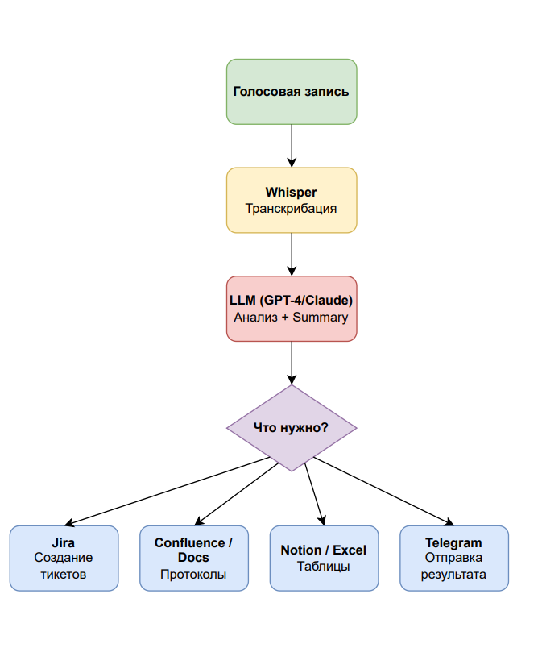

# Voice2Action  
**AI превращает голосовые встречи в готовые документы и задачи**  

> **Закончил созвон — получил протокол, задачи в Jira и аналитику. Без ручного ввода.**

---

## Навигация
- [Суть проекта](#суть-проекта-elevator-pitch)
- [Проблема](#проблема)
- [Решение](#решение)
- [Ключевые функции](#ключевые-функции)
- [Целевая аудитория](#целевая-аудитория)
- [Техническая архитектура](#техническая-архитектура)
- [Структура сайта](#структура-сайта)
- [Как запустить](#как-запустить)
- [Telegram-бот](#telegram-бот)
- [Демо](#демо)
- [Roadmap](#roadmap)
- [Команда и контакты](#команда-и-контакты)

---

## Суть проекта (Elevator Pitch)

**Voice2Action** — это **AI-ассистент для команд и продаж**, который:

1. **Слушает** твои созвоны (Zoom, Telegram, записи)  
2. **Расшифровывает** речь → текст (Whisper)  
3. **Анализирует** содержание → выделяет **задачи, решения, дедлайны**  
4. **Создаёт** документы и тикеты в **Jira, Confluence, Google Docs, Notion, Excel**

> **Результат:** 2 часа рутины → 2 минуты ожидания.

---

## Проблема

| Проблема | Последствия |
|--------|-----------|
| Ручное ведение протоколов после встреч | 2–4 часа на команду в неделю |
| Нет анализа звонков продаж | Менеджеры не получают обратную связь |
| Информация "застревает" в аудио | Нет структуры → нет действий |
| Разрозненные инструменты | Данные не синхронизируются |

> **Факт:** Команды тратят **до 20% рабочего времени** на документацию после встреч.

---

## Решение



### 3 шага до результата:
1. **Загрузил запись**  
2. **AI обработал** (30 сек — 2 мин)  
3. **Получил готовое** в нужных сервисах

---

## Ключевые функции

| Функция | Для кого | Пример |
|-------|--------|--------|
| **Авто-протоколы** | Команды dev | `Протокол спринта 30.10` → Confluence |
| **Тикеты в Jira** | PM, разработчики | `V2A-101: Добавить авторизацию` |
| **Анализ звонков** | Продажи, колл-центры | "Слишком много 'эээ', паузы >3 сек" |
| **Персональные рекомендации** | Менеджеры | "Говори увереннее, задавай больше вопросов" |
| **Telegram-бот** | Все | Отправил голосовое → получил summary |
| **Реал-тайм режим** | Онлайн-встречи | Бот в созвоне → тикеты по ходу |

---

## Целевая аудитория

| Аудитория | Боль | Решение |
|---------|------|--------|
| **Команды разработки** | Ручные протоколы, задачи | Авто-Jira + Confluence |
| **Отделы продаж** | Нет обратной связи | Анализ стиля + summary |
| **Колл-центры** | Контроль качества | Оценка операторов |
| **Менеджеры проектов** | Разрозненные данные | Единая точка входа |

---

## Техническая архитектура

- **Язык:** Python 3.10+
- **AI:** Whisper (OpenAI), LLM (OpenAI/Claude)
- **Интеграции:** REST API, OAuth
- **Архитектура:** Модульная, легко масштабируется

---

## Структура сайта

```
voice2action-site/
├── index.html          Главная страница
├── features.html       Подробно о функциях
├── pricing.html        Цены и планы
├── contact.html        Форма обратной связи
├── css/style.css       Адаптивные стили
├── js/
│   ├── main.js         Плавная прокрутка, формы
│   └── demo.js         Имитация обработки аудио
├── assets/
│   ├── img/
│   │   ├── logo.svg
│   │   ├── demo.gif
│   │   └── icons/
│   └── audio/sample.mp3
├── telegram-bot/
│   └── bot.py          Telegram-бот (Python)
└── README.md           
```

---


## Roadmap

| Этап | Что будет | Срок |
|------|----------|------|
| MVP | Демо-сайт + Telegram-бот | Готово |
| v0.1 | Реальная обработка (Whisper + GPT) | Ноябрь 2025 |
| v0.5 | Интеграции с Jira/Google | Декабрь 2025 |
| v1.0 | Личный кабинет, подписки | Январь 2026 |
| v2.0 | Реал-тайм + мобильное приложение | Март 2026 |

---

## Команда и контакты

| Роль                           | Контакт |
|--------------------------------|--------|
| **Основатель / AI-архитектор** | [Telegram] |
| **Разработчик**                | [Telegram] |
| **Аналитик**                   | [@voice2action_bot]|
| **Дизайнер**                   | [voice2action.ai]|

